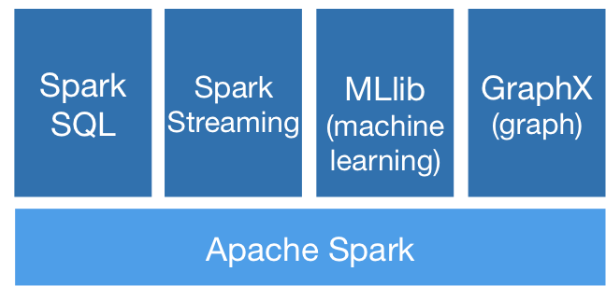
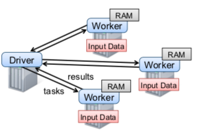

* [preface](#preface)
* [references:](#references)
  * [websites](#websites)
  * [papers](#papers)
* [spark overview](#spark-overview)
  * [what is spark?](#what-is-spark)
  * [spark architecture](#spark-architecture)
  * [spark install](#spark-install)
* [spark basic](#spark-basic)
  * [deal with text file](#deal-with-text-file)
     * [top n words](#top-n-words)
  * [transformation vs action](#transformation-vs-action)
* [Resilient Distributed Datasets](#resilient-distributed-datasets)


_lighting-fast unified analytics engine_

# preface

用了这么长时间的spark一直没有静下心来总结一下这一段时间的学习和心得体会。这里整理成一个文档从浅到深来归纳总结，方便以后回顾时查阅方便

这个github将包含一系列用scala编写的demo, 数据集, spark的使用心得和踩坑，以及架构解释。如有错误，欢迎指正。和机器学习相关的特征预处理，模型训练，模型预测等模块会单独放到另一个github里来总结

GitHub地址： https://github.com/Esail/sparkwiki

# references:

## websites

[1] https://spark.apache.org/ (不用多说，官网是最好的文档，实践是最好的老师，源码是最佳的解释）

[2] https://www.cnblogs.com/qingyunzong/p/8886338.html (非常好的个人总结）

[3] https://www.jianshu.com/p/a2c2fe4371ea (hadoop3.0 new features)

## papers

[1] Resilient Distributed Datasets: A Fault-Tolerant Abstraction for In-Memory Cluster Computing (了解spark的诞生过程）


# spark overview

## what is spark?
spark官方给出的说明是，spark是一个**高效(light-fast)，统一(unified)，分析引擎(analytics engine)**
 
* 高效是因为spark是分布式的，并且基于内存来做计算.无论是在量还是在速上都有显著的提升
* 统一意味着它可以干任何和数据分析相关的工作，从sql查询到实时计算,再到机器学习，图计算都可以在以rdd为核心的spark引擎上完成。
* 分析引擎 spark是分析引擎，意味着它不负责数据的采集和数据的储存，你还需要依赖hdfs,hbase,cassandra来作为数据的储存介质，通过kafka,rabbitMQ等来收集日志。

下图展示了spark的组成：




## spark architecture

这里简单的讲一下spark的结构，我们后面还会结合hadoop-yarn来具体讲一下。推荐所有人读Matei的**Resilient Distributed Datasets: A Fault-Tolerant Abstraction for In-Memory Cluster Computing**详细了解下spark的核心思想RDD的设计和实现



<a name="来自matei的论文">来自matei的论文</a>

整个的架构分为driver和worker(executor)两个大的组成。从这个图上我们可以看出几个重要的信息：

* driver负责把任务tasks分发给worker来执行
* driver负责聚合worker执行task的results
* worker负责把数据拉到RAM（内存）中
* worker负责执行task计算任务

整个设计特别像是一台汽车，driver就是驾驶员，负责控制方向盘，监控仪表。而worker则是四个轮子，负责前行


## spark install
安装spark非常的简单，当然前提是你有一台mac电脑。
我们使用 brew轻松安装

```
brew update
brew install apache-spark
spark-shell --master local

```

这样会启动一个本地的spark交互界面，打开 [http://localhost:4040/jobs/](http://localhost:4040/jobs/) 可以看到spark的web界面

我们现在在交互界面完成第一个spark任务，不熟悉scala的同学可以去[https://www.tutorialspoint.com/scala/](https://www.tutorialspoint.com/scala/)快速熟悉一下语法。


```

1. 创建一个scala数组 1，2，3，4，5
scala> val testData = Array(1,2,3,4,5)
testData: Array[Int] = Array(1, 2, 3, 4, 5)

2. sc代表spark context，
3. parallelize的作用就是把一个local collection形成rdd
4. toDF()是指把rdd转化成DataFrame

scala> val testRDD = sc.parallelize(testData).toDF()
testRDD: org.apache.spark.sql.DataFrame = [value: int]

5. show()一下可以显示出来，我们看到spark把我们的数组默认成value
scala> testRDD.show()
+-----+
|value|
+-----+
|    1|
|    2|
|    3|
|    4|
|    5|
+-----+

6.可以通过 toDF("test")来改变这个名字

scala> val testRDD = sc.parallelize(testData).toDF("test")
testRDD: org.apache.spark.sql.DataFrame = [test: int]

scala> testRDD.show()
+----+
|test|
+----+
|   1|
|   2|
|   3|
|   4|
|   5|
+----+

```

上方是一个很简单的创建dataframe然后展示的操作。一个有意思的点是，我们创建的rdd到底是被切成了几份呢

通过testRDD.rdd.getNumPartitions可以看出数据被切成了一份。这个值由 defaultParallelism 来决定，而不同模式不同数据不同资源下这个值和分区数都是会变化的。我们暂时不关心这个值有什么用，但是后面spark调优时，这个值将发挥作用


# spark basic 
我们继续操作spark，在操作中熟悉spark的功能，这样稍后分析源码时会有一个直观的印象


## deal with text file
我们现在用spark操作一个文本文件

```
object TextDemo extends App {
	val spark = SparkSession.builder().master("local[*]").getOrCreate()
}
```

首先通过SparkSession来创建一个对话。这里分享一个小技巧，就是如何拿到resources下的文件路径

```
val words = this.getClass.getResource("/words.txt").getPath
```

如果想要在代码里将rdd转换成dataframe格式，需要

```
import spark.implicits._
```
隐式转换在spark是一个非常重要的概念，详情参考： https://docs.scala-lang.org/zh-cn/overviews/core/implicit-classes.html 

**完整代码**

```
import org.apache.spark.sql.SparkSession

object TextDemo extends App {
	val spark = SparkSession.builder().master("local[*]").getOrCreate()
	val words = this.getClass.getResource("/words.txt").getPath
	val sc = spark.sparkContext
	import spark.implicits._
	val lines = sc.textFile(words).toDF("word")
	lines.show()
}
```
可以看出全部显示成一列，然后列的title是 word

```
+---------+
|     word|
+---------+
|        A|
|        a|
|       aa|
```

我们统计个数 用count()

```
println(lines.count())
```

我们给所有词加个后缀

```
val newLines = lines.map(r => r.getAs[String]("word") + "_happy")
newLines.show()
```

通过map我们可以给集合中的每一个元素添加一个操作，而r=>r.getAs则可以拿出这个元素，然后添加后缀

如果预先已经知道了dataframe的列是如何分布的也可以通过r=>r.get(index)拿到对应的列，这样代码会更简洁，如下：

```
val newLines = lines.map(r => r.get(0) + "_happy")
newLines.show()
```

其实
val newLines = lines.map(r => r.get + "_happy") 竟然也可以工作，但是有一定副作用，这个留给大家去发现


### top n words
我们下面进行一个复杂的操作即经典的统计词频然后返回topN


```

object WordCountDemo extends App {
	val spark = SparkSession.builder().master("local[*]").getOrCreate()
	val words = this.getClass.getResource("/beauty.txt").getPath
	val sc = spark.sparkContext
	import spark.implicits._
	val wordsCount = sc.textFile(words)
		.flatMap(line => line.split(" "))
		.map(word => (word, 1))
		.reduceByKey(_+_)
		.toDF("word", "count")
		.orderBy($"count".desc)
	wordsCount.show()
	val n = 7
	val topN = wordsCount.take(n).mkString(",")
	println(topN)
}
```
输出

```
[the,32],[to,29],[and,27],[that,25],[of,22],[a,22],[was,17]
```

这里的flatMap, map, reduceByKey, orderBy都是spark强大的算子。spark提供了超过80种high-leverl operator来完成复杂的数据操作，关于算子的具体使用可以参考：

[https://spark.apache.org/docs/latest/rdd-programming-guide.html](https://spark.apache.org/docs/latest/rdd-programming-guide.html)


## transformation vs action
spark的操作主要分为transformation和action. 顾名思义，transformation只是做了变换，但并未真正执行。action操作时才会真正触发执行操作。action操作甚至支持异步的方式，这样执行不会阻塞


常见的transformation操作有：

* map(func): 对rdd的每个元素执行一个func操作，然后返回一个新的rdd
* fliter(func): 挑选elements即过滤掉不符合条件的元素
* flatMap(func):  压平操作，func这里返回的是seq而非单个item
* intersection: 交集操作
* groupByKey 聚集操作
* distinct 返回一个新的rdd包含去重后的元素

常见的actions有：

* reduce(func): 聚合元素
* collect(): Return all the elements of the dataset as an array at the driver program. This is usually useful after a filter or other operation that returns a sufficiently small subset of the data
* count(): 统计个数
* saveAsTextFile: 把rdd的elements写到hdfs或其他文件系统

具体每个的执行可以参考 operators这个目录。正是有了这些强大的算子，spark才会如此强大

## 


# Resilient Distributed Datasets

从这里开始我们会进入spark的核心部分，我强烈建议读者优先阅读官网的例子和github上一些基本操作.否则会看的很头疼


